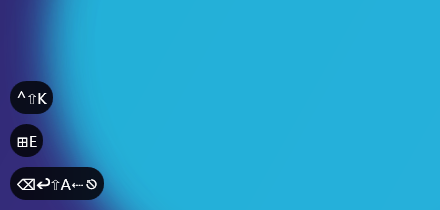
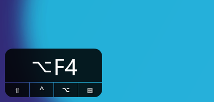
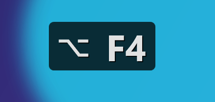
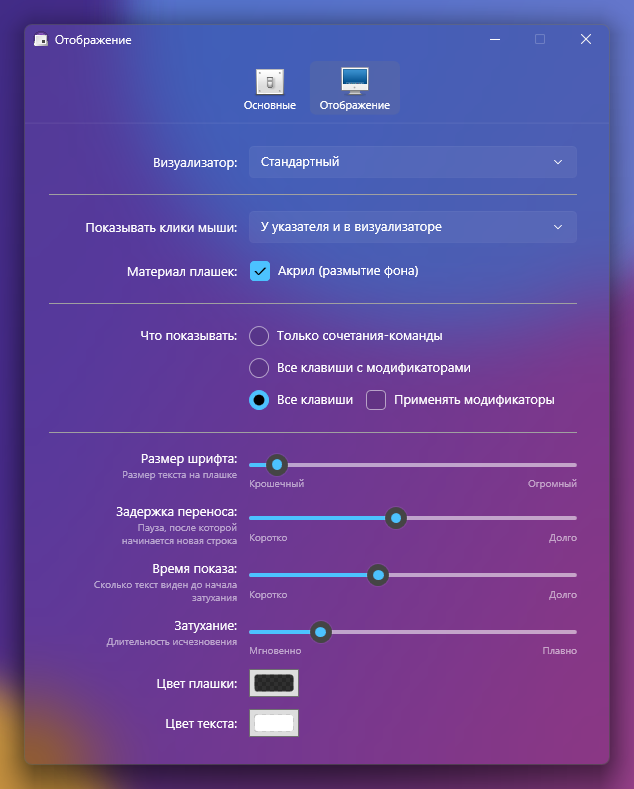
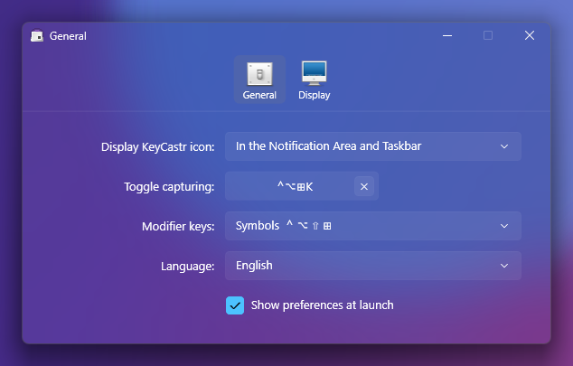

# WinKeyCastr

[English](README.md) · **Русский**

Программа для Windows 11, которая показывает на экране нажатые клавиши и клики мыши. Это порт
[KeyCastr](https://github.com/keycastr/keycastr) для macOS. Пригодится для записи скринкастов, демонстраций и презентаций.

Визуализаторы, настройки, значения по умолчанию и формат отображения клавиш повторяют исходный код
KeyCastr. Плашки умеют размывать фон под собой (эффект акрила).

## Скриншоты

| Стандартный | Svelte | Минимальный |
| --- | --- | --- |
|  |  |  |

| Настройки → Отображение | Настройки → General (на английском) |
| --- | --- |
|  |  |

## Скачать

Последняя версия лежит в [Releases](https://github.com/nikethebike/WinKeyCastr/releases/latest):

- `WinKeyCastr-win-x64.exe` — автономная сборка, запускается сразу.
- `WinKeyCastr-win-x64-framework-dependent.exe` — файл меньше, но нужен [.NET 10 Desktop Runtime](https://dotnet.microsoft.com/download/dotnet/10.0).

Программа не подписана, поэтому Windows SmartScreen может показать предупреждение. Нажмите
*Подробнее → Выполнить в любом случае*.

## Требования

- Windows 11
- Для сборки нужен .NET 10 SDK, для запуска сборки без встроенного .NET — .NET 10 Desktop Runtime.

## Сборка и запуск

```powershell
dotnet build
dotnet run --project src/WinKeyCastr
dotnet test
```

Релизная сборка в один файл:

```powershell
dotnet publish src/WinKeyCastr -c Release -r win-x64 --self-contained false -p:PublishSingleFile=true -o publish
```

## Как пользоваться

- KeyCastr живёт в области уведомлений. Нажмите на его значок (клавиша с логотипом Windows), чтобы
  открыть меню: **О программе**, **Настройки…**, **Начать/Остановить показ**, **Выйти**. Во время
  показа значок залит.
- **Ctrl+Alt+Win+K** включает и выключает показ (в KeyCastr это ⌃⌥⌘K). Сочетание меняется в
  *Настройки → Основные*.
- Плашку можно перетащить мышью, программа запомнит положение.
- Повторный запуск программы открывает настройки уже запущенной копии.
- Интерфейс на русском или английском: *Настройки → Основные → Язык*. По умолчанию язык берётся из системы.

### Визуализаторы (Настройки → Отображение)

| Визуализатор | Что показывает |
| --- | --- |
| **Стандартный** | Стопка плашек в левом нижнем углу. Быстро набранные клавиши попадают в одну плашку, а сочетания-команды, клики и паузы начинают новую. Режимы: *Только сочетания-команды* (по умолчанию), *Все клавиши с модификаторами*, *Все клавиши*, плюс *Применять модификаторы*. Настраиваются размер шрифта, задержка переноса, время показа, длительность затухания и цвета. |
| **Svelte** | Небольшая панель с последними нажатиями и индикаторами ⇧ ⌃ ⌥ ⊞, которые подсвечиваются, пока клавиша зажата. |
| **Минимальный** | Одна плашка с тем, что зажато прямо сейчас: модификаторы, клавиша и кнопка мыши. |

*Показывать клики мыши* добавляет кольцо вокруг указателя при клике, показывает клики в визуализаторе или делает и то, и другое.

## Клавиши Mac и Windows

| macOS | Windows | Отображение |
| --- | --- | --- |
| ⌃ Control | Ctrl | ⌃ |
| ⌥ Option | Alt / AltGr | ⌥ |
| ⇧ Shift | Shift | ⇧ |
| ⌘ Command | Win | ⊞ |

- KeyCastr считает сочетания с ⌃ и ⌘ *командами*. В Windows командами считаются и сочетания с **Alt**
  (Alt+Tab, Alt+F4). **AltGr** — нет: на нём печатают символы, как на маковском Option.
- В *Настройки → Основные → Модификаторы* можно включить текстовые подписи (`Ctrl+Shift+K`), если
  зрители не привыкли к маковским символам.
- Клавиши отображаются в раскладке окна, в котором вы печатаете: в русской раскладке Ctrl+C будет `⌃С`.

## Отличия от KeyCastr

- **Акрил.** Размытие фона под плашками, включается в *Настройки → Отображение → Материал плашек*.
  Используется host backdrop brush из Windows.UI.Composition: обычный акрил Windows 11 становится
  сплошным у неактивных окон, а плашки активными не бывают никогда.
- **Область уведомлений и панель задач** вместо строки меню и Dock. Если выбрано «На панели задач»,
  закрытое окно настроек сворачивается на панель задач, как значок в Dock.
- Нет вкладки обновлений (Sparkle).
- На значке-клавише вместо ⌘ нарисован логотип Windows.
- Windows защищает окна, запущенные от администратора, от перехвата обычными программами. Чтобы видеть
  нажатия в таких окнах, запустите WinKeyCastr тоже от имени администратора.

## Структура проекта

```text
src/WinKeyCastr/
  Input/         глобальный перехват клавиатуры и мыши, перевод нажатий в текст (порт KCEventTransformer)
  Localization/  строки интерфейса на английском и русском
  Overlay/       окна поверх всех окон, не забирающие фокус, и акриловая подложка
  Visualizers/   Стандартный, Svelte, Минимальный и кольцо для кликов мыши
  Settings/      настройки, сохраняются в %APPDATA%\WinKeyCastr\settings.json
  UI/            окна настроек и «О программе», значок в трее, выбор цвета, запись сочетаний
tests/WinKeyCastr.Tests/   тесты форматирования клавиш (перенесены из KeyCastr) и перевода раскладок
```

Debug-сборка принимает `--demo Default|Svelte|Minimal` и проигрывает заранее заданные нажатия, не
трогая реальный ввод и не сохраняя настройки. Флаги `--prefs` и `--display` открывают настройки,
`--ru` включает русский интерфейс.

## Лицензия

Лицензия BSD проекта KeyCastr, под которую попадают использованные иконки, приведена в
[THIRD-PARTY-NOTICES.md](THIRD-PARTY-NOTICES.md).
